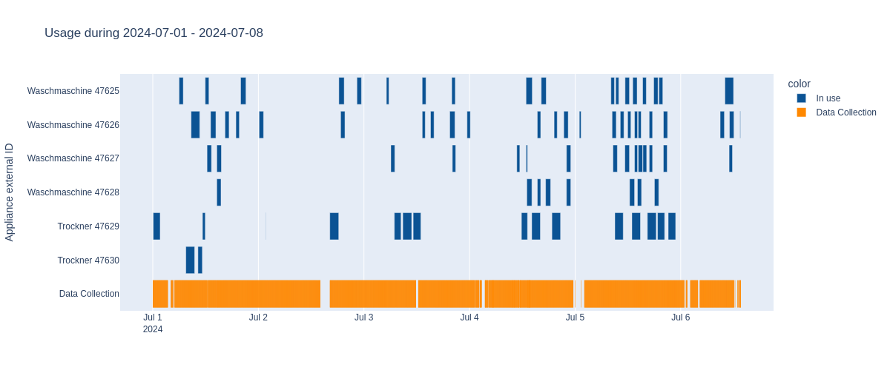
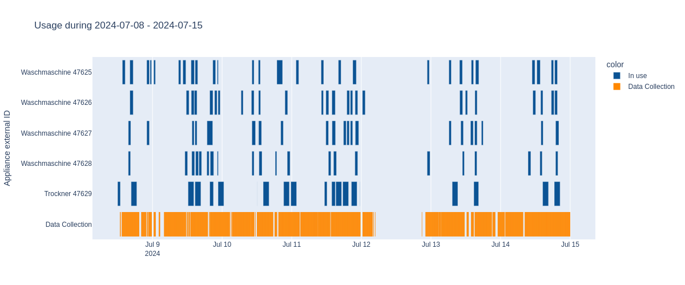
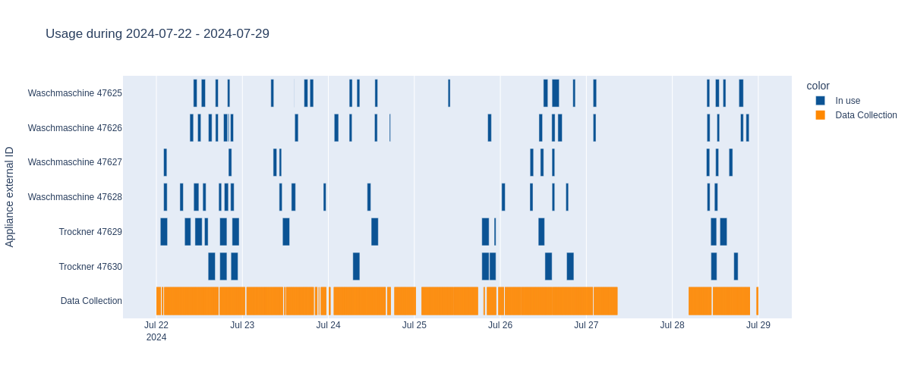

# Introduction

This project aims to analyse the usage of the common washing machines in a particular apartment building in Berlin.

The data is extracted from a 3rd party app, run through OCR, stored in a Postgres DB and analyzed in a Jupyter notebook.

The analysis results can be seen in the conclusions in this document.

## Project structure

The data is always abailable through a third party app, this data is stored as a screenshot in 5 minutes intervals in the Android device, the images are then send to a local server which analyzes them using OCR and stores the valid results in a Postgres DB, non valid images are moved to a failed folder for further inspection and debugging.

The analysis is done in a Jupyter notebook retrieving the data from the Postgres DB.

## Technologies used

- Shell scripting (Linux)
- Postgres (Supabase)
- SQL
- Jupyter Notebook
- OCR (Doctr)
- Android App (MacroDroid)
- Python libraries
  - Pandas (data analysis)
  - Plotly Express (visualization)
  - Supabase client (Postgres client, ORM)
  - Psycopg2 (Postgres client, SQL)
  - Doctr (OCR)

## Notable files

### src/OCR/ocr_reader_and_writer.py

Runs the OCR against the images, stores the valid results in a Postgres DB and moves the invalid images to a failed folder.

### src/DE/data_exploration.ipynb

The analysis in notebook form.

## In the analysis the following graphs were created

### Usage Timeline and Uptime for the whole period

### Usage Timeline and Uptime for each week

### Average use per time of day

### Most used weekdays

### Most used times

# Conclusions found in the data exploration

1. The dryers are not profitable and are just breaking even (See limitations #1 below)
2. Friday is the day with most use (average of 0.84 Washing Machines running at any given time) followed closed by Sunday (0.82).
3. The most used time, averaging at least 1 Washing machine running, is between 10:50 and 16:00 and from 19:00 to 21:00.
4. The machines are regularly used in the middle of the night all the way till 3:00, the earliest anyone has used the machines was around 4:20, this also leads that no machine was ever used from 3:00 to 4:20.
5. The position of the machines directly corresponds to the number of hours in use, the closest to the door being the most used and so on.
6. The running profit is around 43,43 € per day.

# Limitations

1. The dryer energy consumption was taken directly from the datasheet for the product and it is the peak consumption, the average consumption should be lower but since it is an older model the average consumption sticker that is commonly found on current devices is not available.
2. The previous point means the total cost is actually lower making the dryers profitable.
3. As this project was running on a local Android Machine there were downtime when this machine was needed for another tasks, this is represented in the graphs.
4. As the collectio of data run every 5 minutes, the run time of every machine should be slightly higher, as much as 4 minutes and 59 seconds per run.
